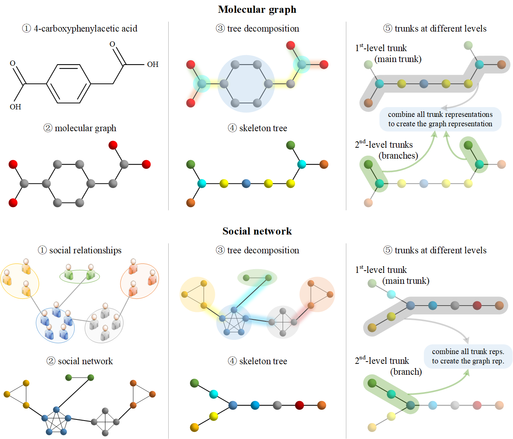

# Graph Trunk Network (GTR)

The official implementation of **[Growing Like a Tree: Finding Trunks From Graph Skeleton Trees](https://ieeexplore.ieee.org/document/10330013) (TPAMI 2023)**.



## 1&nbsp; Installation Instructions

Follow the steps below to set up the virtual environment.

Create and activate the environment:
```shell
conda create -n gtr python=3.6
conda activate gtr
```

Install dependencies in the listed order:
```shell
pip install rdkit-pypi==2021.3.5
pip install -r requirements.txt
pip install torch==1.4.0+cu100 -f https://download.pytorch.org/whl/torch_stable.html
pip install torch_scatter==2.0.4 -f https://pytorch-geometric.com/whl/torch-1.4.0+cu100.html
pip install torch_sparse==0.6.1 -f https://pytorch-geometric.com/whl/torch-1.4.0+cu100.html
pip install torch-geometric==1.7.0
pip install ogb==1.2.6
```

## 2&nbsp; Experiments

### 2.1&nbsp; TUDataset

Reproduce the results reported in Table 3.
Repeat the experiment 100 times using the same evaluation protocol as [Karhadkar et al.](https://github.com/kedar2/FoSR) to obtain the reported results.

#### MUTAG

```shell
python main_tu.py --name MUTAG --batch_size 16 --hidden_dim 64 --num_layers 4 --dropout 0.5 --lr 0.001 --lr_factor 0.5 --lr_limit 1e-5 --max_level 5
```

#### ENZYMES

```shell
python main_tu.py --name ENZYMES --batch_size 16 --hidden_dim 64 --num_layers 4 --dropout 0.5 --bidirectional --lr 0.001 --lr_factor 0.5 --lr_limit 1e-5 --max_level 10
```

#### PROTEINS

```shell
python main_tu.py --name PROTEINS --batch_size 16 --hidden_dim 64 --num_layers 4 --dropout 0.5 --bidirectional --lr 0.001 --lr_factor 0.1 --lr_limit 5e-6 --max_level 10
```

#### IMDB-BINARY

```shell
python main_tu.py --name IMDB-BINARY --batch_size 16 --hidden_dim 64 --num_layers 4 --dropout 0.5 --lr 0.001 --lr_factor 0.5 --lr_limit 2e-5 --max_level 2
```
 
#### COLLAB

```shell
python main_tu.py --name COLLAB --batch_size 32 --hidden_dim 64 --num_layers 4 --dropout 0.5 --lr 0.001 --lr_factor 0.5 --lr_limit 2e-5 --max_level 12
```

### 2.2&nbsp; Graph Benchmarks

Reproduce the results reported in Table 4.

#### ogbg-molhiv

Repeat the experiment 10 times using the same evaluation protocol as [Hu et al.](https://github.com/snap-stanford/ogb) to obtain the reported results.

```shell
python main_ogbhiv.py --name ogbg-molhiv --batch_size 128 --hidden_dim 128 --num_layers 4 --dropout 0.5 --lr 0.0003 --lr_factor 0.5 --lr_limit 5e-5 --max_level 4
```

#### Peptides-func

Repeat the experiment 4 times using the same evaluation protocol as [Dwivedi et al.](https://github.com/vijaydwivedi75/lrgb) to obtain the reported results.

```shell
python main_pepfunc.py --name Peptides-func --batch_size 128 --hidden_dim 256 --num_layers 4 --dropout 0.5 --lr 0.0004 --lr_factor 0.5 --lr_limit 2e-5 --max_level 12
```

#### Peptides-struct

Repeat the experiment 4 times using the same evaluation protocol as [Dwivedi et al.](https://github.com/vijaydwivedi75/lrgb) to obtain the reported results.

```shell
python main_pepstrc.py --name Peptides-struct --batch_size 128 --hidden_dim 256 --num_layers 3 --dropout 0.2 --lr 0.0004 --lr_factor 0.5 --lr_limit 2e-5 --max_level 12
```

### 2.3&nbsp; Visualization

We provide the IPython Notebook file `visualization.ipynb` for reproducing the visualizations shown in Figure 3 (Section 5.6).

<!-- ## 3&nbsp; Questions and Contact

If you have any questions, please feel free to contact Zhongyu Huang at huangzhongyu2020@ia.ac.cn. -->

## 3&nbsp; Citation

If you find this code or our GTR paper helpful for your research, please cite our paper using the following information:

```
@article{huang2023growing,
  title   = {Growing Like a Tree: Finding Trunks From Graph Skeleton Trees},
  author  = {Huang, Zhongyu and Wang, Yingheng and Li, Chaozhuo and He, Huiguang},
  journal = {IEEE Transactions on Pattern Analysis and Machine Intelligence},
  year    = {2023}
}
```
